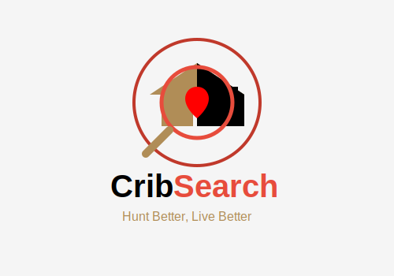

# CribSearch 

## ***Hunt Smarter. Live Better.***

CribSearch is a web and mobile real estate discovery platform designed to transform traditional property search into
an immersive aerial exploration experience. Inspired by the intuitive navigation style of mapping platforms like
Google Maps, CribSearch enables users to visually scout neighborhoods using a satellite-based, interactive map
interface.

Rather than browsing static lists only, users explore properties from an aerial point of view, with real-time, color-
coded markers indicating availability and status. The platform combines geospatial mapping, live property data,
advanced filtering tools, and premium analytics to bridge the gap between passive browsing and intelligent property
decision-making.
CribSearch operates on a freemium model, offering accessible core features while monetizing advanced tools for
serious buyers, investors, agents, and developers.

**Primary Goal**

Enable users to visually discover, analyze, and compare properties using a dynamic aerial interface—reducing
unnecessary physical visits and accelerating decision-making.

# Core Features

- Map-Centric Interface
- Satellite/aerial default view
- Smooth panning, zooming, tilting (3D view)
- Real-time interactive property markers
- Marker clustering at low zoom levels

# Property Status Markers

* Green: Vacant / Available
* Red: Occupied / Full
* Yellow: Pending / Unconfirmed

Markers expand into detailed overlays when clicked.

# Property Details Panel

Clicking a marker reveals:

- Image gallery
- Price
- Description
- Amenities
- Virtual tour (if available)
- Contact/schedule viewing
- Save to favorites

